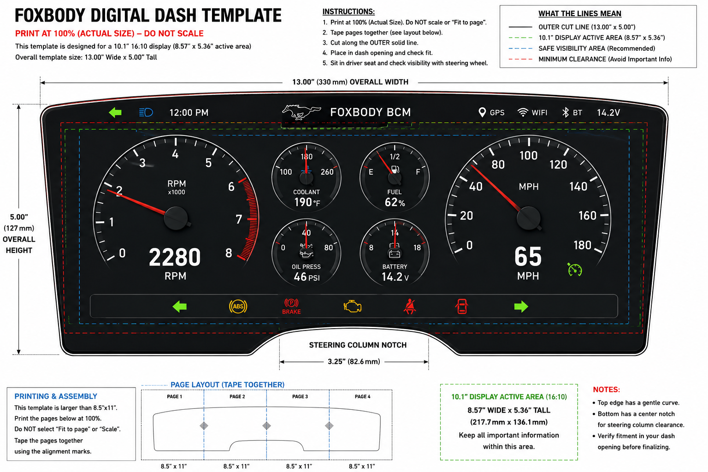

# FoxbodyDash

<p align="center">
  
</p>

A modern touchscreen digital dashboard and Body Control Module (BCM) for the 1988 Ford Mustang Foxbody.

FoxbodyDash is more than a digital gauge cluster. It is part of a complete vehicle electronics system built around a Raspberry Pi that replaces many of the functions normally handled by separate automotive modules.

The goal is to combine a professional-quality digital dashboard with a custom Body Control Module into a single integrated platform while maintaining an OEM-style appearance and operation.

---

# Project Goals

Build a modern vehicle electronics system capable of providing:

- Digital instrument cluster
- Touchscreen user interface
- Body Control Module (BCM)
- Vehicle diagnostics
- Vehicle settings
- Expandable architecture
- OEM-style reliability
- Modern convenience features

This project is designed specifically for the 1988 Ford Mustang Foxbody but is being developed using modular software that can be adapted to other vehicles.

---

# Major Features

## Digital Dashboard

- SVG Analog Tachometer
- SVG Analog Speedometer
- Coolant Temperature
- Oil Pressure
- Fuel Level
- Battery Voltage
- Warning Indicators
- Turn Signals
- High Beam Indicator
- Gear Indicator
- Shift Lights
- Startup Animation
- Day/Night Themes
- Multiple Gauge Layouts
- Touchscreen Navigation

---

## Integrated Body Control Module

Unlike most digital dash projects, FoxbodyDash also functions as the vehicle's Body Control Module.

The BCM software controls vehicle accessories and communicates directly with the Raspberry Pi GPIO hardware.

Current and planned BCM features include:

- Push Button Start
- RFID / Phone Key
- Power Door Locks
- Automatic Door Unlock
- Automatic Headlights
- Automatic Wipers
- Courtesy Lighting
- Interior Light Fade
- Window Control
- Automatic Window Roll Down
- Rain Sensor Integration
- Ambient Light Sensor
- Reverse Camera Control
- Horn Control
- Parking Light Flash
- Security System
- Alarm Functions
- Future CAN/LIN Expansion

---

# Engine Management

FoxbodyDash is designed to integrate with aftermarket engine management.

Current development target:

- MicroSquirt ECU

Future support may include additional ECUs through modular communication drivers.

---

# Hardware

Current development hardware:

- Raspberry Pi 4
- 10.1" Capacitive Touch Display
- HDMI LCD
- GPIO Expansion
- I²C Expansion
- Opto-Isolated Input Modules
- MOSFET Output Modules
- Relay Drivers

---

# Software Architecture

The project is divided into reusable modules.

```
FoxbodyDash/

assets/
components/
css/
docs/
js/
pages/
themes/

index.html
README.md
```

The BCM and Dashboard communicate internally while remaining modular enough to allow future expansion.

---

# Development Roadmap

## Version 0.4

Professional Gauge Engine

- SVG Gauges
- 270° Gauge Faces
- Professional Layout
- Improved Dashboard UI

## Version 0.5

Dashboard Features

- Startup Animation
- Demo Mode
- Warning Icons
- Theme Engine

## Version 0.6

Body Control Module

- GPIO Integration
- Input Module Support
- Output Module Support
- Lighting Control
- Door Lock Control

## Version 0.7

Vehicle Integration

- Live ECU Data
- BCM Communication
- Diagnostics
- Vehicle Settings

## Version 1.0

First Complete Vehicle Installation

---

# Project Philosophy

This project is focused on creating a digital dashboard that looks and behaves like it could have been installed by Ford while adding modern convenience features found in current production vehicles.

Rather than using multiple independent controllers, the dashboard and Body Control Module are integrated into a single Raspberry Pi platform using modular software architecture.

---

# Status

🚧 Active Development

Current Milestone:

**Version 0.4 — Professional Gauge Engine**

---

# Author

Designed and developed by:

**Daron Fritts**

with software development assistance from OpenAI ChatGPT.